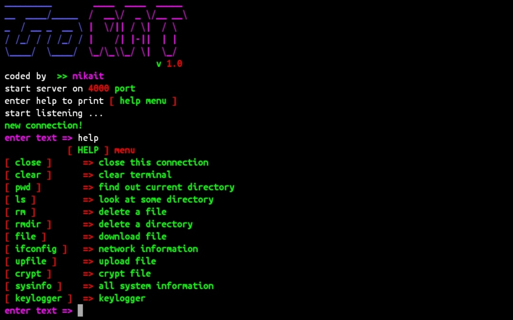

## GoRAT

Hi, this is RAT for the Windows operating system version 7, 8 and 10. 
The server part can be run on any operating system where Golang is installed.

## Install
1. Clone this repository.
2. Edit the client.go file in IP;
specify the public ip address of the computer where the server.go file will be launched;
you can also change the PORT in client.go and server.go to the same one.
3. On the Windows operating system, you need to compile the client.go file with the command: go build -ldflags -H=windowsgui client.go.
4. If you wish, you can compress the finished exe file with the upx packer and come up with a distribution method, but you yourself will decide.

## GoRat features
[ close ]     => close this connection

[ clear ]     => clear terminal
  
[ pwd ]       => find out current directory

[ ls ]        => look at some directory

[ rm ]        => delete a file

[ rmdir ]     => delete a directory

[ file ]      => download file from victim up to 65 kb

[ ifconfig ]  => network information

[ upfile ]    => upload file to victim up to 65 kb

[ crypt ]     => file encryption using AES

[ sysinfo ]   => all system information

## Donate

    monero: 
    48TmwHGVsqSKgD7giTALoK7P2muKLTJn5R8s5XtKZL1jEr4MJFBAwczVtofuFGvzsT1CzTcFXotwZCDno1UsskqFFZe9wVC
***
    bitcoin:
    18LKUKWAUBAFKzLBdFFkt687vh8rMPhL1u
***
    ethereum:
    0x189a9436b2fbBd0b1C3927E8a398379DBb7105AA
